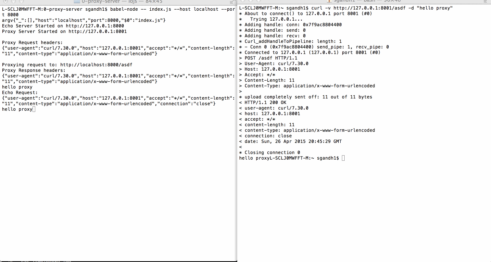

# codepath-nodejs
# Proxy Server

This is a Proxy Server for Node.js submitted as the [pre-work](http://courses.codepath.com/snippets/intro_to_nodejs/prework) requirement for CodePath.


Completed:
- [x] Required: Requests to port 8000 are echoed back with the same HTTP headers and body
- [x] Required: Requests/reponses are proxied to/from the destination server
- [x] Required: The destination server is configurable via the --host, --port or --url arguments
- [x] Required: The destination server is configurable via the x-destination-url header
- [x] Required: Client requests and respones are printed to stdout
- [x] Required: The --logfile argument outputs all logs to the file specified instead of stdout
- [ ] Optional: The --exec argument proxies stdin/stdout to/from the destination program
- [ ] Optional: The --loglevel argument sets the logging chattiness
- [x] Optional: Supports HTTPS (Some sample done. Have more questions.)
- [x] Optional: -h argument prints CLI API

# Home work 0

### Run server with nodemon

```
npm install -g eslint babel babel-eslint nodemon
cd 0-proxy-server
npm install
npm start
```

### Run proxy server with options

```
--host upstream host name, default 127.0.0.1
--port upstream port, default 8000 for 127.0.0.1, default 80 for others
--url upstream host:port, this will override --host and --port value
--logfile complete logfile path
```

### Check list

successfully echo requests

```
babel-node -- index.js
curl -v -X POST http://127.0.0.1:8000 -d "hello self" -H "x-asdf: yodawg"
```

successfully proxy requests

```
babel-node -- index.js
curl -v http://127.0.0.1:8001/asdf -d "hello proxy"
 ```

CLI

```
babel-node -- index.js --host localhost --port 8000
curl -v http://127.0.0.1:8001/asdf -d "hello proxy"
 ```

CLI Showing dynamic proxying on per request basis
```
babel-node -- index.js --host google.com
curl -v http://127.0.0.1:8001/  (shows request being forwarded to google.com on port 80)
curl -v -X POST http://127.0.0.1:8001 -d "hello self" -H "x-destination-url: http://localhost:8000"  (Shows header controlling where the request is routed)

```
logging to a file 

```
babel-node -- index.js --host localhost --port 8000 --logfile /tmp/proxy.log 
or 
npm start -- --logfile=/tmp/proxy.log
curl -v http://127.0.0.1:8001/path -d "hello proxy"
cat /tmp/proxy.log
```


### Screenshot




